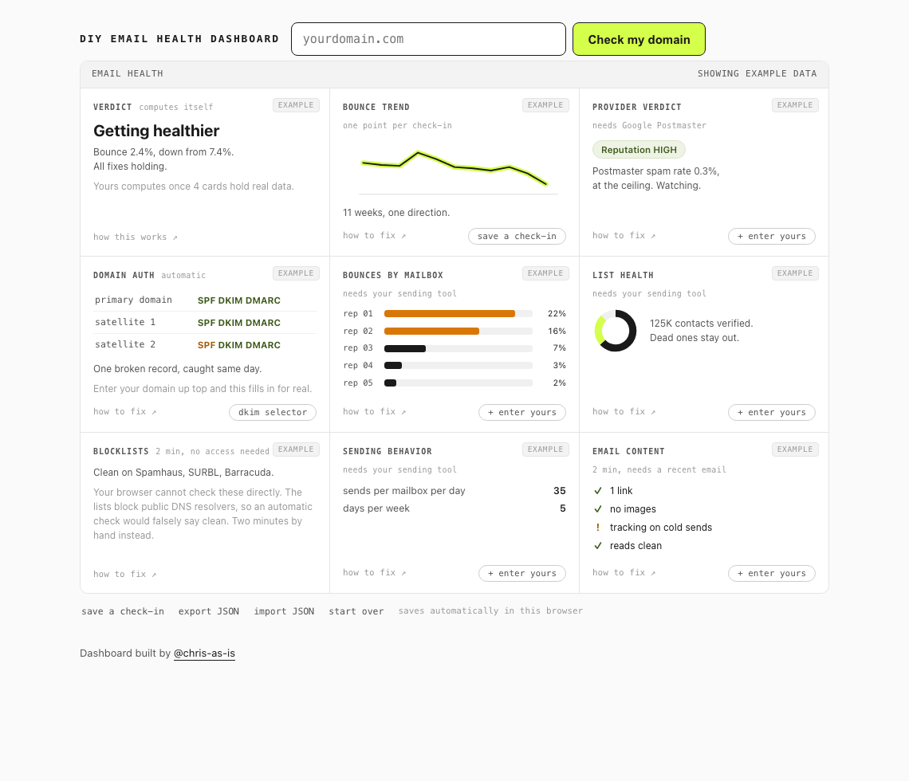

# DIY Email Health Dashboard

A free deliverability dashboard that mostly fills itself. One HTML file. No accounts, no server, no build step.

It's the dashboard from [How to Get Out of Spam Jail](https://chris-as-is.com/projects/spam-jail), DIY edition. That post covers a real recovery: 7.4% bounce down to 2.4% in six weeks. This page opens showing those numbers as example data, so you can see what healthy-in-progress looks like. Then you swap in your own.

**Use it here:** [spamjail.chris-as-is.com](https://spamjail.chris-as-is.com)

Or run it on your own domain in one step: `spamjail.chris-as-is.com/?domain=yourdomain.com`

## How it works

Type your domain up top and hit check. The page reads your public DNS records (SPF, DKIM, DMARC, MX) straight from the browser, including lookalike sending domains like getyourbrand.com.

If you send with Smartlead, paste your API key (Smartlead → Settings → API key) into any sending-tool card and four more cards fill themselves: bounce rate across your campaigns, warmup spam per mailbox, sending caps, and a weekly bounce trend. The key is stored in this browser's localStorage only, and every call goes straight from your browser to `server.smartlead.ai`. No proxy, no middleman, and exports never include the key. Read the code, it's one file.

Why only Smartlead: it's the major sending tool that allows browser-direct API calls. Instantly and HubSpot block them (CORS), so those stay hand-entry.

Everything else is a number you go find and paste in. Click any example value and the card tells you where to find the real one. No Smartlead? Save a check-in each week and the bounce trend chart builds itself.

## The 7 cards, in the order worth doing them

| Card | Effort | What you need |
|------|--------|---------------|
| Domain auth | automatic | nothing |
| Blocklists | 2 min | nothing, just click the links |
| List health | automatic with a Smartlead key, else 5 min | your sending tool |
| Bounces / warmup by mailbox | automatic with a Smartlead key, else 5 min | your sending tool |
| Sending behavior | automatic with a Smartlead key, else 2 min | your sending tool |
| Bounce trend | automatic with a Smartlead key, else weekly check-ins | your sending tool |
| Provider verdict | 15 min setup | Google Postmaster (needs Google admin or DNS access) |
| Email content | 2 min | one recent email from your team |

The verdict card computes itself once 4 cards hold real data.

## What leaves your browser (full disclosure)

Your numbers and any API key stay in your browser (localStorage). Nothing you type is sent to any server of mine.

Two things do leave the tab:

- The automatic DNS check queries two public resolvers over HTTPS: `https://cloudflare-dns.com/dns-query` (Cloudflare) and `https://dns.google/resolve` (Google, fallback). They see the domain names being looked up, the same as any DNS lookup.
- If you connect Smartlead, your browser calls `https://server.smartlead.ai` directly with your key. That traffic is between you and Smartlead only.

The hosted copy at spamjail.chris-as-is.com also runs Cloudflare Web Analytics, a cookieless visit counter, so I can tell if people use this. It gets added at deploy time (see deploy.sh), so the `index.html` in this repo has none. Self-host and nothing is counted.

## Self-hosting

It's one file. Download `index.html`, open it. Works from `file://`. Put it on any static host if you want a URL.

## Honest limits

- Green auth records mean your DNS passes checks. They do not prove inbox placement. Nothing that runs in a browser can prove inbox placement.
- DKIM is checked by probing common selector names (google, selector1, s1 and friends). If yours is custom, add it in the card. "Not observed" means not found on common selectors, not "missing."
- Blocklists can't be auto-checked from a browser. Spamhaus and friends block public DNS resolvers, so an automatic check would falsely say clean. The card gives you lookup links instead.
- The satellite domain sweep guesses from naming patterns (getbrand.com, trybrand.com, brand.io). Remove anything that isn't yours.
- The targets (0.3% spam rate, 2% bounce, ~50 sends/mailbox/day) are the ones from the post. The first two come from Google. The last one is a heuristic, not a law.

## Backups

Export JSON gives you a file with everything. Import brings it back. localStorage can get cleared by the browser, so export once in a while if you care about the trend history.

## License

MIT. Built by [@chris-as-is](https://chris-as-is.com).
